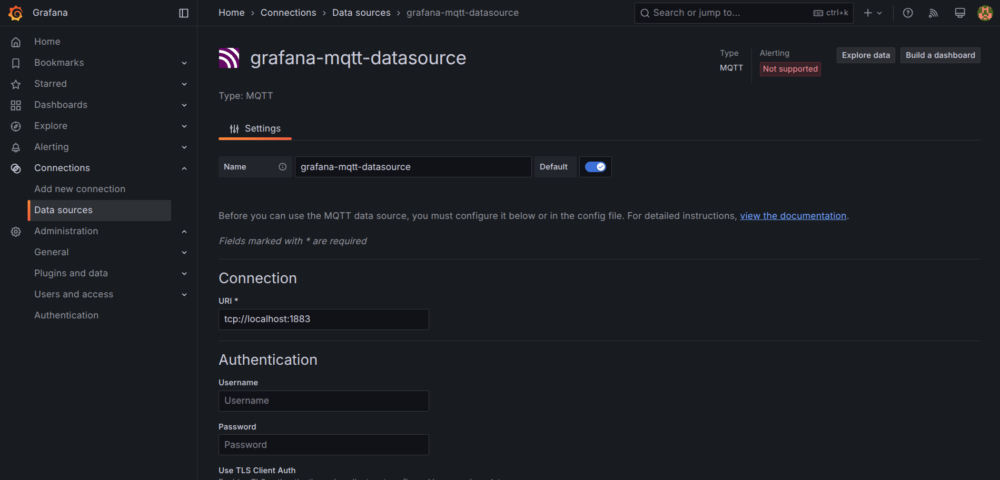
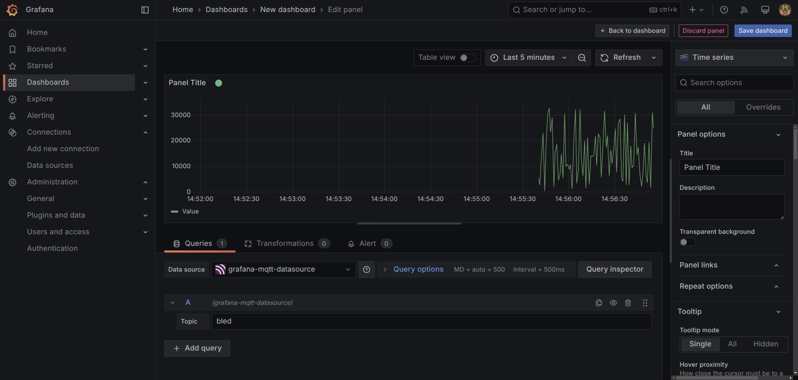
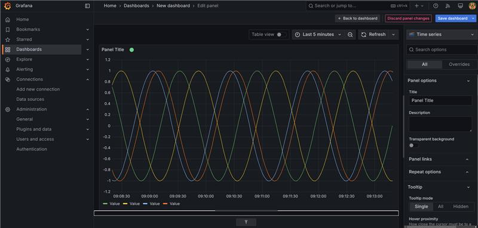
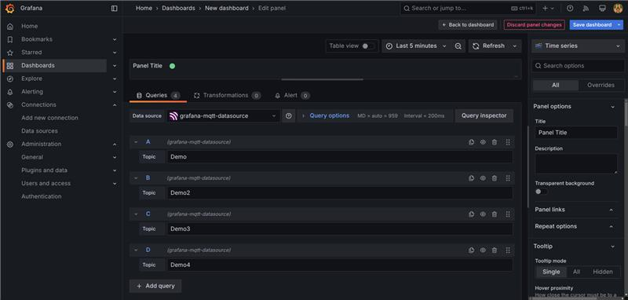

# Inhaltsverzeichnis

- [MQTT-System mit Dummy-Sensoren](#mqtt-system-mit-dummy-sensoren)  
- [MQTT Publisher mit Java und Maven](#mqtt-publisher-mit-java-und-maven)  

# MQTT-System mit Dummy-Sensoren

## 1. Einleitung
Diese Dokumentation beschreibt den Aufbau und die Erweiterung eines MQTT-Systems auf einer Ubuntu-VM. Ziel ist es, ein MQTT-System mit mehreren Dummy-Sensoren zu erstellen, die fortlaufend Daten an einen MQTT-Broker senden.

## 2. Theoretische Grundlagen

### 2.1 Komponenten einer MQTT-Applikation
Eine MQTT-Applikation besteht aus drei Hauptkomponenten:
1. **Broker** – Vermittelt Nachrichten zwischen Publisher und Subscriber.
2. **Publisher** – Sendet Nachrichten an ein bestimmtes Topic.
3. **Subscriber** – Abonniert Topics und empfängt Nachrichten.

### 2.2 Nachrichtenzustellung
Daten gelangen vom Sender zum Empfänger über ein **Publish-Subscribe-Modell**. Der Publisher sendet Nachrichten an ein Topic, das der Broker verwaltet. Abonnenten, die dieses Topic abonniert haben, erhalten die Nachrichten.

### 2.3 Empfang aller Nachrichten
Ein Subscriber kann alle Nachrichten empfangen, indem er ein **Wildcard-Topic** (`#` oder `+`) abonniert.

### 2.4 Anwendungsgebiete von MQTT
- IoT-Systeme (z. B. smarte Sensoren, Home Automation)
- Industrielle Automatisierung
- Überwachungssysteme
- Kommunikationssysteme für Fahrzeuge

### 2.5 Vorteile von MQTT
- Leichtgewichtig und ressourcenschonend
- Unterstützt geringe Bandbreite und hohe Latenzen
- Skalierbar für viele Geräte

## 3. Praktische Umsetzung

### 3.1 Installation der benötigten Software
Die folgenden Komponenten müssen auf der Ubuntu-VM installiert werden:

```bash
sudo apt update
sudo apt install -y docker-ce mosquitto-clients
```

### 3.2 Einrichtung des MQTT-Brokers mit Docker
Ein MQTT-Broker wird als Docker-Container mit Eclipse Mosquitto bereitgestellt.

#### Konfigurationsdatei `mosquitto.conf`
Erstelle eine Datei `mosquitto.conf` mit folgendem Inhalt:

```plaintext
listener 1883
allow_anonymous true
```

#### Starten des Containers mit der Konfiguration

```bash
docker run -d --name mosquitto \
    -p 1883:1883 -p 9001:9001 \
    -v $(pwd)/mosquitto/config/mosquitto.conf:/mosquitto/config/mosquitto.conf \
    eclipse-mosquitto
```

### 3.3 Testen des Brokers

#### Abonnieren eines Topics:
```bash
mosquitto_sub -t test
```

#### Senden einer Nachricht:
```bash
mosquitto_pub -t test -m "hello world"
```

**Erwartetes Ergebnis:** Die Nachricht `"hello world"` erscheint im ersten Terminal.

## 4. Erweiterung mit Dummy-Sensoren

### 4.1 Manuelle Simulation mehrerer Sensoren
Jeder Sensor sendet eine Zufallszahl an ein spezifisches Topic im Sekundentakt. Dies kann durch mehrere Terminals simuliert werden:

```bash
while true; do mosquitto_pub -t sensor1 -m $RANDOM; sleep 1; done
```

```bash
while true; do mosquitto_pub -t sensor2 -m $RANDOM; sleep 1; done
```

### 4.2 Automatisierung mit einem Bash-Skript
Ein Skript zur Simulation mehrerer Sensoren:

```bash
#!/bin/bash
SENSOR_NAME=$1
while true; do
    VALUE=$RANDOM
    mosquitto_pub -t "$SENSOR_NAME" -m "$VALUE"
    sleep 1
done
```

#### Speichern als `sensor.sh` und ausführbar machen:
```bash
chmod +x sensor.sh
```

#### Aufruf für mehrere Sensoren:
```bash
./sensor.sh sensor1 &
./sensor.sh sensor2 &
```

## 5. Virtualisierung

### 5.1 Connection Settings


### 5.2 Dashboard



## 6. Fazit
Diese Dokumentation beschreibt den Aufbau eines MQTT-Systems mit Docker und die Simulation von Sensoren. Durch die Automatisierung mit Bash-Skripten wird die Verwaltung mehrerer Sensoren erleichtert. Dies bildet die Grundlage für erweiterte IoT-Anwendungen.

# MQTT Publisher mit Java und Maven

## 1. Einführung
Dieses Projekt implementiert einen MQTT-Publisher in Java, der periodisch Werte an ein spezifiziertes Topic sendet. Die Werte werden mit der **sinusförmigen Funktion** generiert.

## 2. Projekt-Erstellung mit Maven
Das Projekt wird mit **Maven** erstellt. Dazu wird folgender Befehl verwendet:

```bash
mvn archetype:generate -DartifactId=MavenDemo -DgroupId=ch.wiss.m321 -DarchetypeArtifactId=maven-archetype-quickstart -DarchetypeVersion=1.5
```

### Erklärung der Parameter:
- `-DartifactId=MavenDemo` → Der Name des generierten Projekts
- `-DgroupId=ch.wiss.m321` → Die Gruppierung des Pakets (z. B. Unternehmens- oder Schul-ID)
- `-DarchetypeArtifactId=maven-archetype-quickstart` → Verwendet die Quickstart-Archetype für ein einfaches Java-Projekt
- `-DarchetypeVersion=1.5` → Definiert die Archetype-Version

Nach dem Ausführen dieses Befehls wird das Projektverzeichnis `MavenDemo` mit einer Standardprojektstruktur generiert.

## 3. Implementierung des MQTT-Publishers
Der Code für den MQTT-Publisher befindet sich in der Datei [`App.java`](src/main/java/ch/wiss/m321/App.java).

## 4. Kompilieren und Ausführen
### 4.1 Projekt bauen
Das Projekt kann mit **Maven** kompiliert werden:

```bash
mvn clean package
```

Nach der erfolgreichen Kompilierung befindet sich die ausführbare `.jar`-Datei im `target`-Ordner.

### 4.2 Programm ausführen
Das Programm erwartet beim Start ein MQTT-Topic als Argument:

```bash
java -jar target/MavenDemo-1.0-SNAPSHOT.jar Demo
```

Hierbei wird das Topic `Demo` verwendet.

## 5. Testen mit MQTT-Tools
### 5.1 Abonnieren eines Topics
In einem separaten Terminal kann ein **Subscriber** gestartet werden, um die gesendeten Werte zu empfangen:

```bash
mosquitto_sub -t Demo
```

### 5.2 Erwartetes Ergebnis
Alle **500 Millisekunden** wird ein neuer Wert (basierend auf der Sinusfunktion) ausgegeben.

## 6. Grafana
### 6.1 Monitoring



### 6.2 Grafana Settings



## 7. Fazit
- Das Projekt demonstriert die Verwendung von **Java** und **MQTT** mit **Maven**.
- Es sendet kontinuierlich **Sinuswerte** an ein spezifiziertes MQTT-Topic.
- Die Implementierung kann leicht erweitert werden, z. B. um mehrere Sensoren oder eine stabilere Client-Verbindung.